# TestPRO

**`UNDER DEVELOPMENT`**

## Screenshot

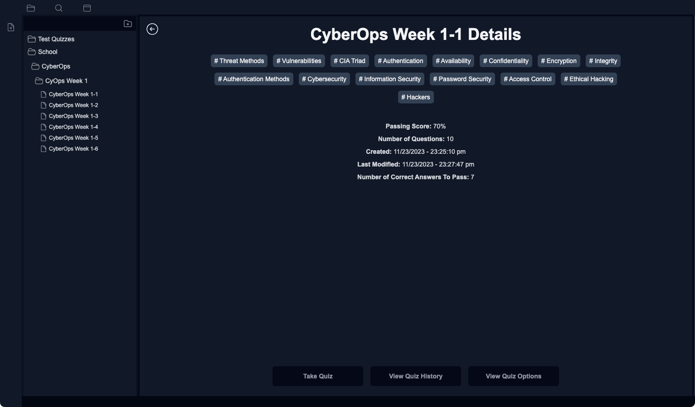

## Table of Contents

- [Description](#description)
  - [Motivation](#motivation)
  - [User Story](#user-story)
- [Demo](#demo)
- [Tech Stack](#tech-stack)
- [Usage](#usage)
  - [Installation](#installation)
  - [Creating an OpenAI API Key](#creating-openai-api-key)
  - [Creating Environment Variables](#creating-environment-variables)
  - [Editing Environment Variables](#editing-environment-variables)
  - [Tests](#tests)
  - [Running in Development](#running-in-development)
    - [Front End and API Server](#front-end-and-api-server)
    - [Just the Front End](#just-the-front-end)
    - [Just the API Server](#just-the-api-server)
  - [Starting the App](#starting-the-app)
    - [Building the App](#building-the-app)
    - [Running the Production Build](#running-the-production-build)
  - [Creating Quizzes](#creating-quizzes)
  - [Example Overview](#example-overview)

## Description

### COMING SOON

Test Pro is a studying tool designed to help you study for exams and retain information.

### Motivation

I am a FullStack Web Developer and CyberOps Engineering Student currently preparing for CompTIA Exams, particularly Security+, Network+, and hopefully the CySA+. I hope to take the exams in the coming months. While I can read my study materials thoroughly, I recognize the need for a more effective way to review and consolidate the information. The goal is to develop a digital tool akin to flashcards, organized for comprehensive review and progress tracking.

### User Story

`As a learner, I want to create quiz questions to reinforce my understanding of various topics and prepare for my exams. The ability to revisit and retake these quizzes is important to me. Additionally, I would like to review questions associated with a specific topic. Post-quiz, I aim to review both correct and incorrect answers, assess my score, and evaluate the time I spent on the quiz. Although accessing this tool across multiple devices is desirable, it's currently not a priority, as I can effectively study using a single computer for now.`

## Demo

Click to watch the demo

[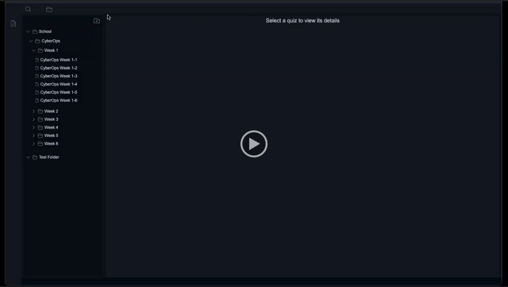](https://drive.google.com/file/d/1GCLM1YE9Fu5b3wlTM_zq3bGPZeBMjU4v/view)

## Tech Stack

| Technology   | Description                                                       | Links                                                               |
| ------------ | ----------------------------------------------------------------- | ------------------------------------------------------------------- |
| Node         | JavaScript runtime environment                                    | [Node.js](https://nodejs.org/en/about)                              |
| TypeScript   | JavaScript with syntax for types                                  | [TypeScript](https://www.typescriptlang.org/)                       |
| Express      | Minimalist web framework for Node.js                              | [Express](https://expressjs.com/)                                   |
| Mongoose ODM | Object modeling for MongoDB and Node.js                           | [Mongoose](https://mongoosejs.com/)                                 |
| MongoDB      | NoSQL distributed document database                               | [MongoDB](https://www.mongodb.com/try/download/community)           |
| Preact       | 3kB replacement for React.js with the same API                    | [PREACT](https://preactjs.com/)                                     |
| Vite         | Front-end tooling and dev environment, replacing Create React App | [Vite](https://vitejs.dev/)                                         |
| LangChain    | Framework for developing apps using LLMs                          | [LangChain](https://js.langchain.com/docs/get_started/introduction) |
| OpenAI       | Underlying LLM. GPT-4                                             | [OpenAI API](https://platform.openai.com/docs/overview)             |

## Usage

### Installation

This project requires a local installation of MongoDB or the use of Mongo Atlas.
If you do not have MongoDB installed on your computer [you can follow the instructions for the community edition in this link](https://www.mongodb.com/docs/manual/installation/).

From the root of the project, run the following command to install the dependencies:

```bash
npm install
```

### Creating OpenAI API Key

This Project uses GPT-4 to assist in converting the user's existing quiz data to JSON, which is used when creating a new quiz. This is
an absolute requirement, and a valid API key must be used. If you do not have an account [you can create one for free](https://platform.openai.com/signup). Once you have your API key, follow the next step.

### Creating Environment Variables

This project relies on the following environment variables:

```md
PORT=<3000>
DB_NAME=<test-pro-development>
PROD_DB_NAME=<test-pro-production>
TEST_DB_NAME=<test-pro-test-db>
DB_URI=mongodb://localhost:27017/
OPENAI_MODEL_NAME=<replaceWithDesiredModel_DefaultsToGPT-4>
OPENAI_API_KEY=<replaceWithYourOpenAI_APIKey>
```

To create the file, run the following command:

```bash
npm run createEnv
```

### Editing Environment Variables

Be sure to replace the default values inside the `<` `>` with your own and the URI to your MongoDB Cluster if you use MongoAtlas over the local installation. You can edit the file with the editor of your choice. It is located at `./packages/server/.env`.

### Tests

Before running the tests, create a .env.test file at `./packages/server/` and copy the contents from the .env file to it.

From the project root:

```bash
    cp ./packages/server/.env ./packages/server/.env.test
```

To verify tests run:

Note: Converting raw text to JSON and a quiz uses GPT-4, which is evaluated in the tests. On my machine, running the tests takes 60-70 seconds to complete and will timeout in 4 minutes. Tests are passing; you only need to run the tests locally if you are having backend issues.

```bash
npm run test
```

### Running in Development

#### Front End and API Server

This will start the API server and load the Vite dev environment for the front end.

```bash
npm run dev
```

#### Just the Front End

```bash
npm run dev-client
```

#### Just the API Server

```bash
npm run dev-server
```

### Starting the App

#### Building the App

You will need to build the app to create a production bundle for first use, or anytime changes have been made.

Simply run the included build command, which builds the client and server:

```bash
npm run build
```

#### Running the Production Build

After the app has been built it can be invoked using the provided start script which runs the production server and opens the application in the browser:

```bash
npm start
```

### Creating Quizzes

Rather than creating one question at a time and then adding them to a quiz, for now, TestPro is designed to _convert_ an existing quiz with as little effort as possible.

For example, while studying for my [CompTIA](https://www.comptia.org/) certifications, I will be using [TestOut](https://w3.testout.com/), which provides review-type quizzes for each section you are studying. Once the quiz has been completed, the raw text can be copied and pasted into a text file. An example can be found and viewed [here](./packages/server/src/bot/alfred/utils/extractQuestionsFromText/testUserInputTestOut.txt).

Using TestPro, the raw text can be parsed and converted into JSON data needed to create a quiz. Unfortunately, your selected answer is not preserved by copying and pasting it to a text file. An LLM is used to answer the questions and assign and generate topics for the questions and quizzes, which can be used for indexed searching later.

In another use-case, a more generic style of quizzes, my university quizzes, an example can be viewed [here](./packages/server/src/bot/alfred/utils/extractQuestionsFromText/testUserInputUA.txt), is used. As we can see, these quizzes do not contain areas to review or an excellent detailed explanation. AI is being leveraged to fill in all the missing gaps in these instances. In the case of the CompTIA study, ten questions are not a big deal. I could see an argument for being lazy. However, a single quiz at the University of Arizona can be as many as 60 or more questions, which is a lot of data to re-type. This tool helps reclaim your time by automating the quiz creation as much as possible.

If quizzes have more than ten questions, they are broken into multiple quizzes with a maximum of 10 questions and will be placed into a folder bearing the quiz name. This makes reviewing the material easier and makes large amounts of information more manageable and easier to retain. We extract as much information as possible from the text files for economic purposes and only ask the model to generate the missing data.

IT IS EXTREMELY crucial to verify the AI-generated data. In most instances, the model is right about 90% of the time. Changing a few wrong inputs is a better use case than manually inputting everything from the beginning. The generated JSON data is displayed where necessary adjustments can be made before creating the quiz in the database.

If a folder is deleted, any containing quizzes are moved to the parent folder by default. Using GPT-4 can add up. It costs under $8 at this time to convert eight weeks' worth of quizzes for a single class. Granted, these quizzes had 50-60 questions each, and the model had to generate topics, explanations, and areas to review and answer the question. In total, 430 questions were converted.

Custom quizzes could be created similarly: create a text file that matches the above formatting.

#### Example Overview

Quizzes can be added to the root or can be created at any existing folder:

`Create at Root`

To create a quiz at the root, simply click the Icon that looks like a document with a plus sign in the middle of it to get started:

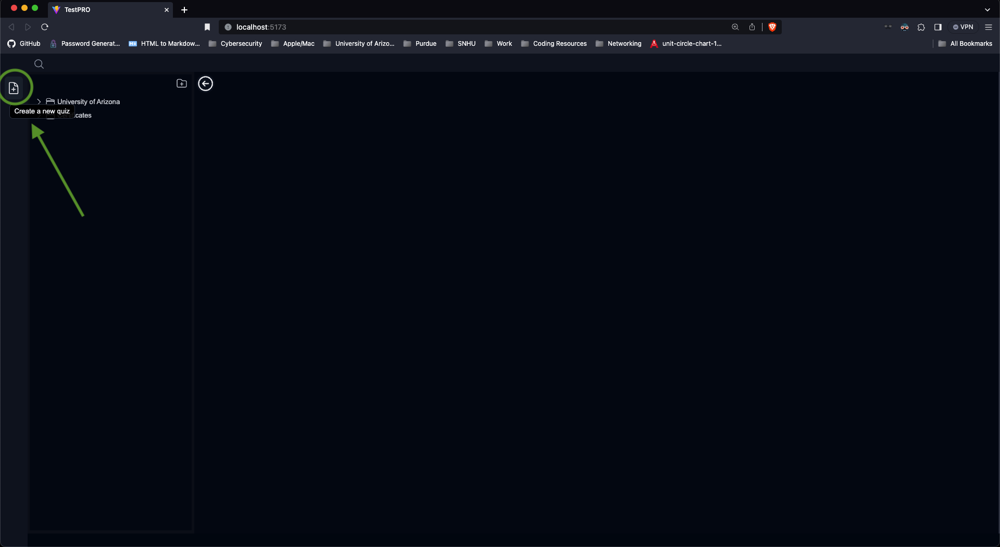

`Created in Existing Folder`

Alternatively, a quiz can be created at the desired destination folder by accessing the folder's context menu. Select the desired folder and right-click -> Create Quiz Here:

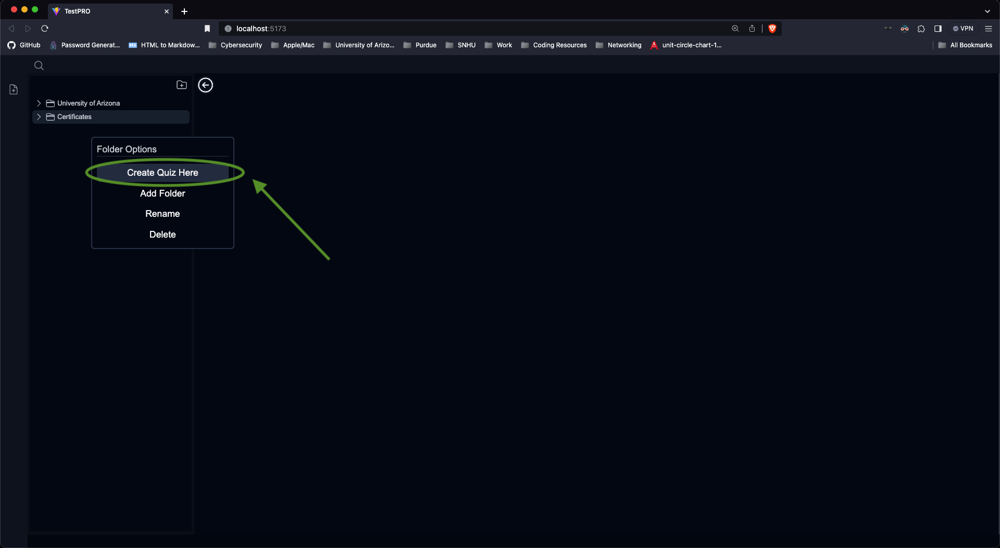

After either method, the `Add Quiz Modal` appears, click on `Choose File`, example test files exist inside of `./packages/server/src/bot/alfred/utils/extractQuestionsFromText/` we will be using the Test Out example because it is only 10 questions.

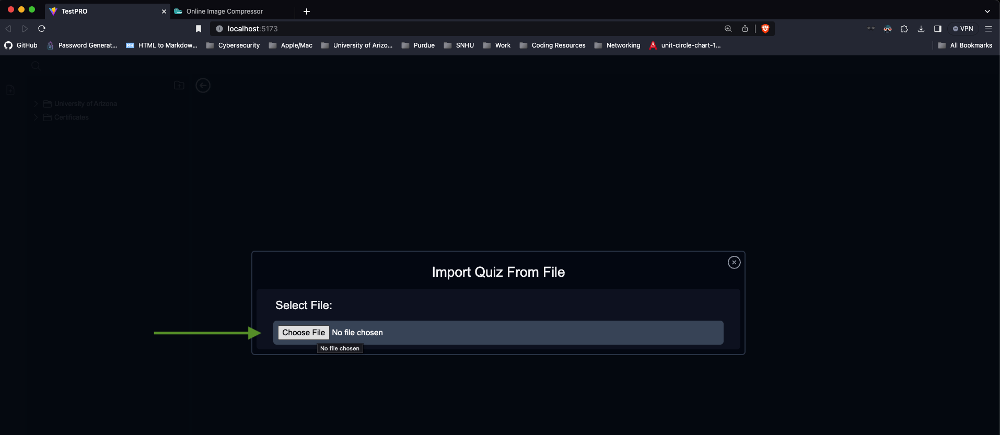

After selecting a file, you can name it. File names are unique and must be alpha numeric, although spaces are tolerated. Once you have come up with a name, ensure you hit <kbd>Enter</kbd> to continue.

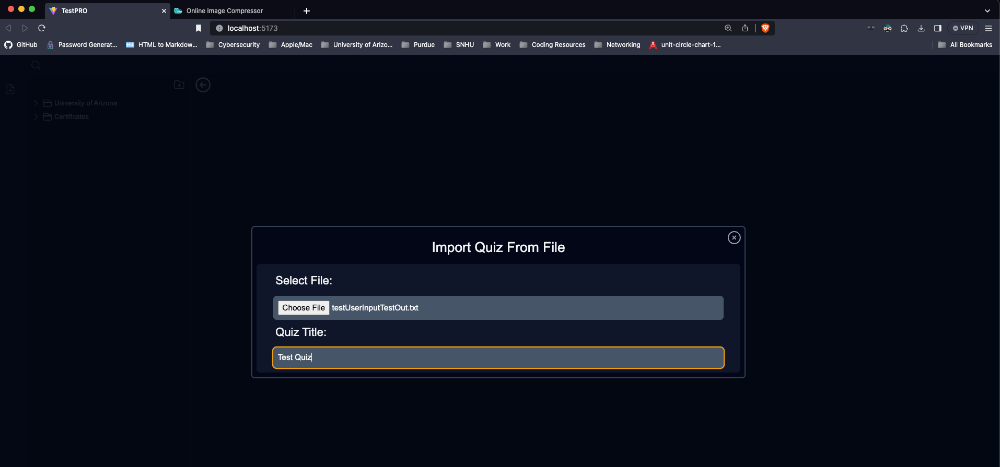

Ensure the correct type of quiz is selected to ensure the file is parsed correctly:

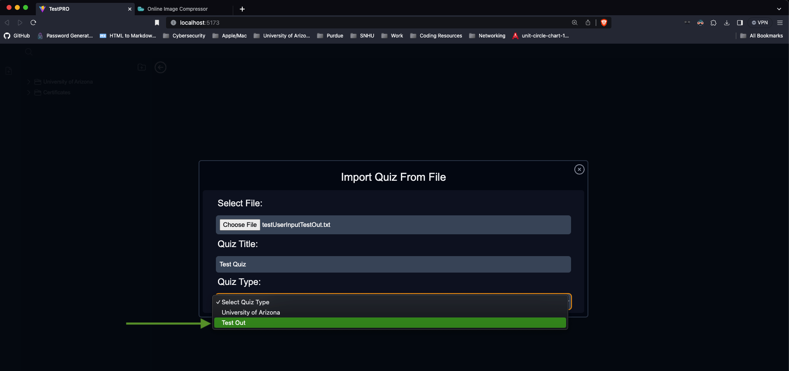

Click on Submit or hit <kbd>Enter</kbd>.

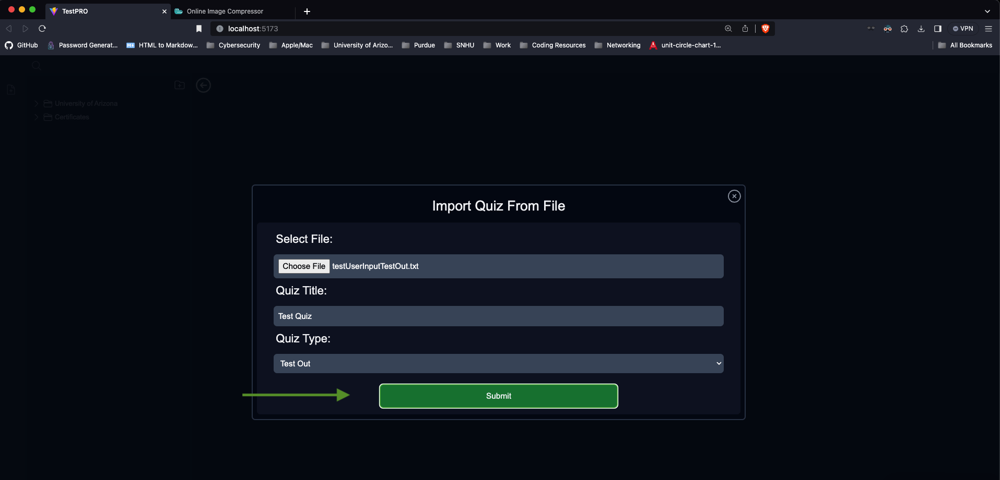

Next we wait, similar to chatting with Chat GPT though the web portal, it takes requests a second to finish:

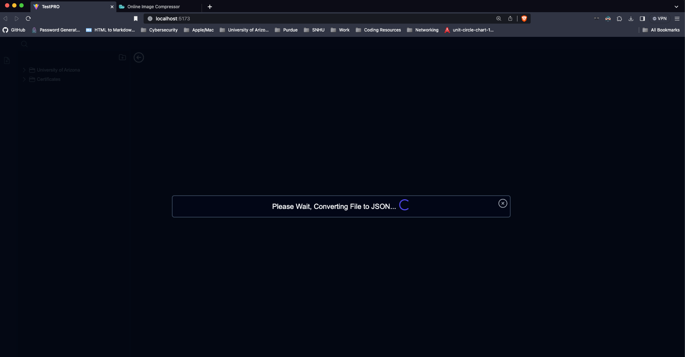

Once the files are converted, they are available for user review. Ensure to double check all AI generated content, ensure the answers are correct, and add any missing topics. Once you are satisfied, click on create quiz.

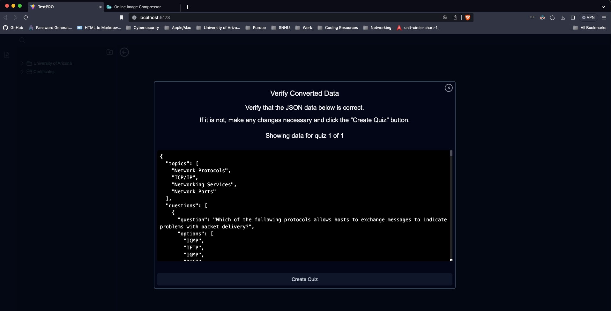

In our case we created a quiz at the root, after clicking on it we can see the details:

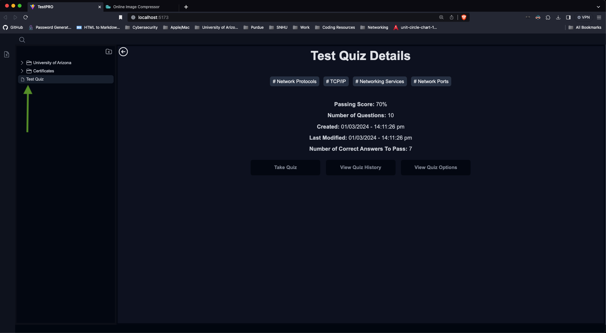
